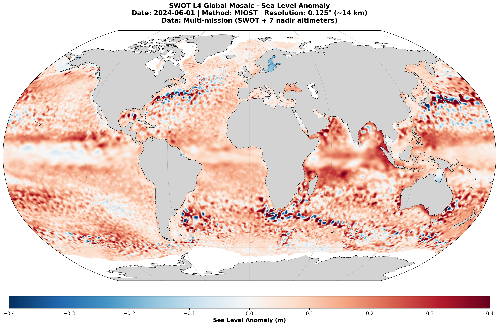

# SWOT Data Visualization

Jupyter notebooks for visualizing SWOT (Surface Water and Ocean Topography) satellite data.

 

## Notebooks

### L4 Product (Gridded)
- **swot_l4_global_visualization_june1_2024.ipynb** - Visualizes SWOT L4 global gridded data for June 1, 2024

### L3 Product (Swath)
- **swot_l3_cycle16_visualization.ipynb** - Visualizes SWOT L3 Basic, all passes from one cycle (cycle 16, May 29-June 18, 2024)


## Requirements

```
xarray
numpy
matplotlib
cartopy
```

## Data

Download SWOT data from AVISO:
- L3: https://doi.org/10.24400/527896/a01-2025.001
- L4: https://doi.org/10.24400/527896/A01-2023.017

Example AVISO Download for L4:
- **download_AVISO_L4.py**

Place data files in:
- `swot_l3_cycle016/` for L3 swaths (cycle 16 here)
- `swot_l4_data/` for L4 gridded products
